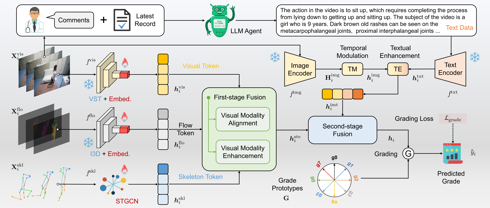

# Two-Stage Multi-Modal Fusion with Adaptive Alignment for Muscle Strength Assessment of Juvenile Dermatomyositis

Created by [Kanglei Zhou*](https://orcid.org/0000-0002-4660-581X), [Ruizhi Cai*](https://orcid.org/0009-0009-3328-0559), [Xinning Wang*](https://orcid.org/0000-0003-0254-6683), [Jianguo Li](https://orcid.org/0000-0001-9431-2950), [Xiaohui Liang](https://orcid.org/0000-0001-6351-2538)

This repository contains the implementation of DualAlign, a novel two-stage fusion method with adaptive alignment, DualAlign, for multi-modal JDM-MSA. Meanwhile, it contains all components of the MM-JDM database, including the data, splits, label sets, and README files.



## MM-JDM Dataset

### Structure

```
MM-JDM
├── feats
│   ├── JDM01_flow_I3D.npy
│   ├── JDM01_rgb_VST.npy
│   ...
│   ├── JDM14_flow_I3D.npy
│   ├── JDM14_rgb_VST.npy
│   ├── JDM_skeleton_raw.npy
│   └── JDM_text_CLIP.npy
├── label.csv
├── README.md
└── splits
    ├── test_split_01.pkl
    ...
    └── train_split_14.pkl
```

### Statistics

The MM-JDM dataset comprises 1863 samples, each containing three vision modalities and one clinical textual modality, encompassing 14 distinct action types.

| Action Index | Action Name             | Grade Num. | Sample Num. |
| ------------ | ----------------------- | ---------- | ----------- |
| 01           | Head Lift               | 0~5        | 123         |
| 02           | Leg Lift                | 0~2        | 134         |
| 03           | Leg Lift and Maintain   | 0~5        | 136         |
| 04           | Turn Over               | 0~3        | 140         |
| 05           | Sit-up of 6 types       | 0~6        | 193         |
| 06           | Sit Up                  | 0~3        | 133         |
| 07           | Arm Lift and Straighten | 0~3        | 128         |
| 08           | Hand Raise and Maintain | 0~4        | 126         |
| 09           | Sit Down                | 0~3        | 127         |
| 10           | Limb Move               | 0~4        | 117         |
| 11           | Stand Up from Kneeling  | 0~4        | 143         |
| 12           | Stand Up from Sitting   | 0~4        | 123         |
| 13           | Step On                 | 0~3        | 133         |
| 14           | Pick Up                 | 0~3        | 107         |

### Data Format

There are **four** modalities in total: three vision-based modalities and one text-based modality, which are accessed in the following data formats respectively.

#### Video Modality

```python
# Name: JDMxx_rgb_VST.npy
# Access
rgb_feats = np.load(f'JDMxx_rgb_VST.npy'), allow_pickle=True).item()
rgb_feat = rgb_feats[sample_name]
# Format [T, C]
```

#### Flow Modality

```python
# Name: JDMxx_flow_I3D.npy
# Access
flow_feats = np.load(f'JDMxx_flow_I3D.npy'), allow_pickle=True).item()
flow_feat = flow_feats[sample_name]
# Format [T, C]
```

#### Skeleton Modality

```python
# Name: JDM_skeleton_raw.npy
# Access
skeleton_data = np.load('JDM_skeleton_raw.npy')
skeleton = torch.tensor(skeleton_data[id])
# Format [T, N, C'] N body keypoints with C'-dimensional coordinates in T frames
```

#### Text Modality

```python
# Name: JDM_text_CLIP.npy
# Access
CLIP_feats = np.load(f'JDM_text_CLIP.npy'), allow_pickle=True).item()
CLIP_video_feats = CLIP_feats[id]['video']
# Format [T, C]
CLIP_text_feats = CLIP_feats[id]['text']
# Format [T, C]
```

### Annotation

| Field Name   | Type   | Description                                                  |
| ------------ | ------ | ------------------------------------------------------------ |
| Sample_Name  | String | Each video corresponds to a sample name, which is distinguished by action category and further uniquely identified by an independent number within each action category. |
| Video_ID     | int    | Each video is uniquely associated with a numerical index.    |
| Action_Type  | int    | Action category.                                             |
| Action_Class | int    | The total count of grade-based categories within the current action. |
| Score        | Int    | The grade-based category of the current video.               |

### Download

To download the MM-JDM dataset, please sign the [Release Agreement]() and send it to [craaaaazy666@gmail.com](mailto:craaaaazy666@gmail.com). By sending the application, you are agreeing and acknowledging that you have read and understand the notice. We will reply with the file and the corresponding guidelines right after we receive your request!


## DualAlign Deployment

### Requirement

+ Python 3.8.19
+ Pytorch 1.9.0
+ cudatoolkit 11.1.1
+ torchvision 0.10.0
+ torchvideotransforms 0.1.2

### Install dependencies:

```bash
pip install -r requirements.txt
```

### Preparing datasets:

To get started with the experiments, you need to prepare the MM-JDM datasets above.

### Train and evaluate:

```bash
python main.py --mode [train/evaluate] --action [01--14] --exp_name [exp_name] --pretrain_feats --no_etf [use ETF or not]
```

